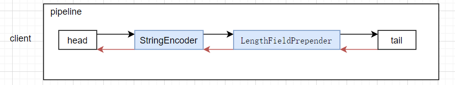

# 阶段目标
- [x]  阶段1 namenode启动 
- [x]  阶段1 namenode启动连接其它的namdenode
- [x]  阶段2 protobuf的生成和使用


# 问题
-  An exceptionCaught() event was fired, and it reached at the tail of the pipeline. It usually means the last handler in the pipeline did not handle the exception
 
 **解决：** 
需要重写handler里的exceptionCaught()


- io.netty.channel.ChannelPipelineException: rechard.learn.namenode.network.NettyServerChannelHandler is not a @Sharable handler, so can't be added or removed multiple times.
 **解决：**
在 NettyServerChannelHandler上加上@Sharable# hdfs

# protobuf

```
mvn protobuf:compile && mvn install
```

# Netty
## Netty的handler的顺序会对消息的解析产生重要的影响
 
红色表示outbound,我将StringEncode和LengthFieldPrepender配错了位置
导致server端解析出错


